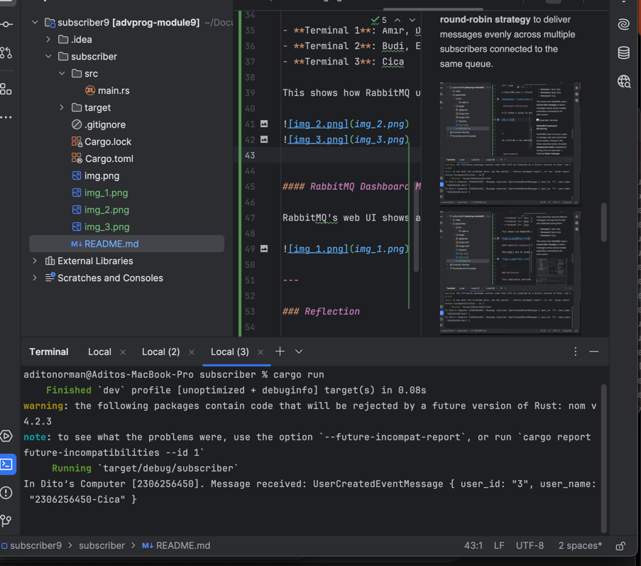

### What is AMQP?

AMQP stands for **Advanced Message Queuing Protocol**. It is an open standard protocol used for passing messages between systems in a message-oriented middleware architecture. AMQP enables reliable communication using message queues and supports features like message delivery guarantees, routing, and publish-subscribe patterns. It is commonly used with message brokers such as RabbitMQ.

---

### What does `guest:guest@localhost:5672` mean?

This is a connection string for connecting to an AMQP broker (like RabbitMQ):

- The first `guest` is the **username** used to authenticate with the broker.
- The second `guest` is the **password** for that user.
- `localhost:5672` is the address of the broker:
    - `localhost` indicates the broker is running on the local machine.
    - `5672` is the default **port number** used by AMQP for connections.

In summary, `guest:guest@localhost:5672` tells the system to connect to a RabbitMQ server running locally, using the default credentials (`guest`/`guest`) on port 5672.

## Simulation slow subscriber screenshot :

In my case, the total number of queued messages reached **1**, as shown in the chart. This means the publisher briefly outpaced the subscriber, and messages were buffered in the queue. After processing, the queue returned to zero, confirming that all events were eventually consumed.

This test demonstrates how message queues decouple producer-consumer speed and ensure reliable delivery even under varying processing loads.

### Parallel Event Processing with Multiple Subscribers

To test RabbitMQ's ability to distribute workload, I ran **3 subscriber instances** in 3 different terminals using `cargo run`, each connecting to the same `user_created` queue. Then, I simulated high message throughput by running the **publisher** multiple times.

#### Terminal Output

Each subscriber received different messages, proving that the load was distributed among them:

- **Terminal 1**: Amir, Dira
- **Terminal 2**: Budi, Emir
- **Terminal 3**: Cica

This shows how RabbitMQ uses a **round-robin strategy** to deliver messages evenly across multiple subscribers connected to the same queue.

#### RabbitMQ Dashboard Monitoring

RabbitMQ's web UI shows a spike in message rate and a short-lived queue buildup. However, with three consumers active, the spike **disappeared faster** compared to having only one subscriber — meaning **faster message consumption**.

---

### Reflection

This simulation confirms a key advantage of event-driven architecture: **horizontal scalability**. When one subscriber isn't fast enough to keep up, we can spawn more instances — and RabbitMQ will balance the load.

---

### Suggested Improvements

- **Logging clarity**: Each subscriber prints the same prefix (`"In Dito’s Computer..."`). We could add a unique instance ID (e.g., environment variable or random UUID) to better identify which terminal processed what.
- **Publisher**: Consider adding timestamps or batch IDs to messages for easier tracking and correlation.
